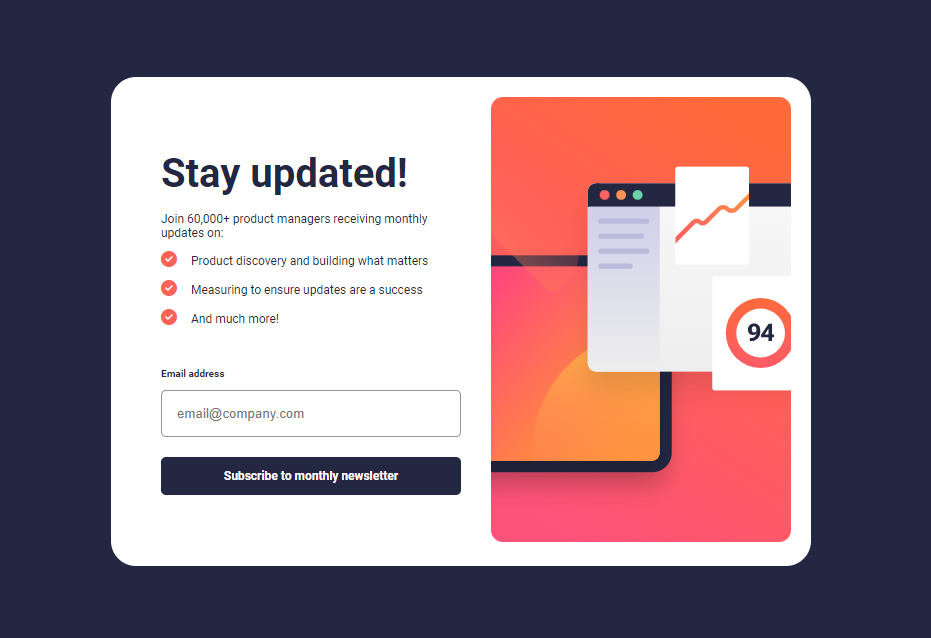

# Projeto Formulário de Inscrição

Esta é uma solução para o [formulário de inscrição no boletim informativo com desafio de mensagem de sucesso no Frontend Mentor](https://www.frontendmentor.io/challenges/newsletter-signup-form-with-success-message-3FC1AZbNrv).

## Visão Geral

 

### O desafio -

Os usuários devem ser capazes de:

- Adicione o e-mail e envie o formulário
- Veja uma mensagem de sucesso com o e-mail após enviar o formulário com sucesso
- Veja as mensagens de validação do formulário se:
  - O campo é deixado em branco
  - O endereço de e-mail não está formatado corretamente
- Veja o layout ideal para a interface, dependendo do tamanho da tela do dispositivo
- Veja os estados de foco e foco para todos os elementos interativos na página

 

### Tela Desktop

 

 

### Tela Mobile

 

 

## Ferramentas usadas

- HTML
- CSS
- JavaScript

 

## Links

https://osmarviana.github.io/newsletter-sign-up

 

# Autor

## Osmar Viana

 
  
   
  
   
  
   

